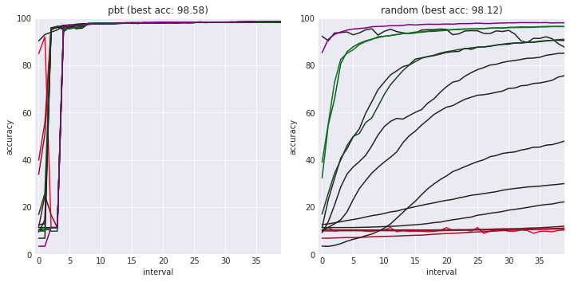
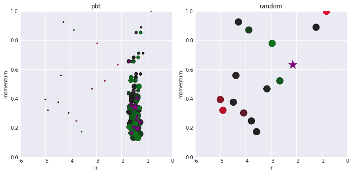

### PBT: Population Based Training

[Population Based Training of Neural Networks, Jaderberg et al. @ DeepMind](https://arxiv.org/abs/1711.09846)

### What this code is

A PyTorch implementation of PBT.

### What this code is for

Finding a good hyperparameter schedule.

### How to use this code

Warning: This implementation isn't user friendly yet. If you have any questions, [create a github issue](https://github.com/MattKleinsmith/pbt/issues/new) and I'll try to help you.

Steps:

1. Wrestle with dependencies.
2. Edit config.py to set your options.
3. Store your data as bcolz carrays. See datasets.py for an example.
4. In a terminal, enter: `python main.py --exploiter`
5. If you want to use a second GPU, then in a second terminal, enter: `python main.py --gpu 1 --population_id -1`, where "1" refers to your GPU's ID in nvidia-smi, and "-1" means to work on the most recently created population.

When finished, the process will print the path to the weights of the best performing model.

### Figures for intuition

These figures are for building intuition for PBT. They aren't the results of a rigorous experiment. In the accuracy plots, the best model is shown in purple. In the hyperparameter scatter plots, the size of the dots grow as the models train. The hyperparameter configurations of the best model from each population are purple stars.

Notice how the hyperparameter configurations evolve in PBT, but stay the same in random search.

### How does PBT work?
PBT trains each model partially and assesses them on the validation set. It then transfers the parameters and hyperparameters from the top performing models to the bottom performing models (exploitation). After transferring the hyperparameters, PBT perturbs them (exploration). Each model is then trained some more, and the process repeats. This allows PBT to learn a hyperparameter schedule instead of only a fixed hyperparameter configuration. PBT can be used with different selection methods (e.g. different ways of defining "top" and "bottom" (e.g. top 5, top 5%, etc.)).

For more information, see [the paper](https://arxiv.org/abs/1711.09846) or [blog post](https://deepmind.com/blog/population-based-training-neural-networks/).

### Selection method in this code

Truncation selection: For each model in the bottom 20% of performance, sample a model from the top 20% and transfer its parameters and hyperparameters to the worse model. One can think of the models in the bottom 20% as being **truncated** during each exploitation step. Leave the top 80% unchanged. This selection method was used in the paper.

### About the figures

The figures above were produced with a naive PBT selection method: select the best model each time. The accuracy improves to around 99.35% with the selection method in the paper: truncation selection. Seeds will change results. [A simple conv net](https://github.com/pytorch/examples/blob/master/mnist/main.py#L52) was used. Dataset: MNIST.

I produced these figures using an old and very different version of this repo. I haven't yet re-added logging and plotting.

### The essence of this code

Managing tasks via a sqlite database table.

Each task corresponds to training a model for half an epoch. These tasks can be done in parallel. Once in a while the exploiter process truncates the worst-performing models, which blocks other processes from training models for a bit. That makes it 99% parallel instead of 100% parallel like random search.

Since this code is mostly about task management, it isn't very tied to a particular deep learning framework. With a little work, one could replace the PyTorch ties with TensorFlow. However, this assumes you have your hyperparameter space defined in your framework of choice, which is what you need for any hyperparameter optimization algorithm, including random search. As of this writing, the hyperparameter space in this code only has two dimensions: learning rate and momentum coefficient.

### Acknowledgements

This repo is inspired by [bkj's pbt repo](https://github.com/bkj/pbt), where they replicated figure 2 of the paper.
